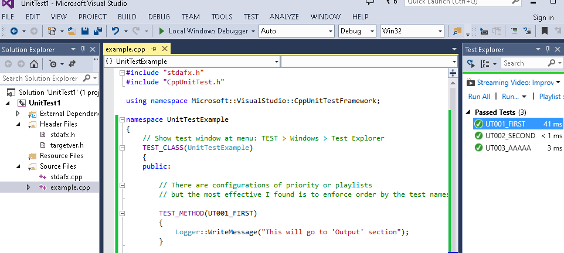

# UnitTest in Visual Studio (Native Unit Test Project)
05/Mar/2023

Example of unit test project features in Visual Studio 2013.

Snippet example:

```cpp
#include "stdafx.h"
#include "CppUnitTest.h"

using namespace Microsoft::VisualStudio::CppUnitTestFramework;

namespace UnitTestExample
{
    // Show test window at menu: TEST > Windows > Test Explorer
    TEST_CLASS(UnitTestExample)
    {
    public:

        // There are configurations of priority or playlists
        // but the most effective I found is to enforce
        // the execution order by the test names:

        TEST_METHOD(UT001_FIRST)
        {
            Logger::WriteMessage("This will go to 'Output' section");
        }

        TEST_METHOD(UT002_SECOND)
        {
            Assert::IsTrue(true, L"Message printed when it fails", LINE_INFO());
        }


        TEST_METHOD(UT003_AAAAA)
        {
            std::wstringstream buff;
            buff << "Nice message" << " with variables " << 123;
            Logger::WriteMessage(buff.str().c_str());

            Assert::AreNotEqual(true, false, buff.str().c_str(), LINE_INFO());
        }
    };
}
```





Source files [here][unittest-zip]


[unittest-zip]: UnitTest1.zip
