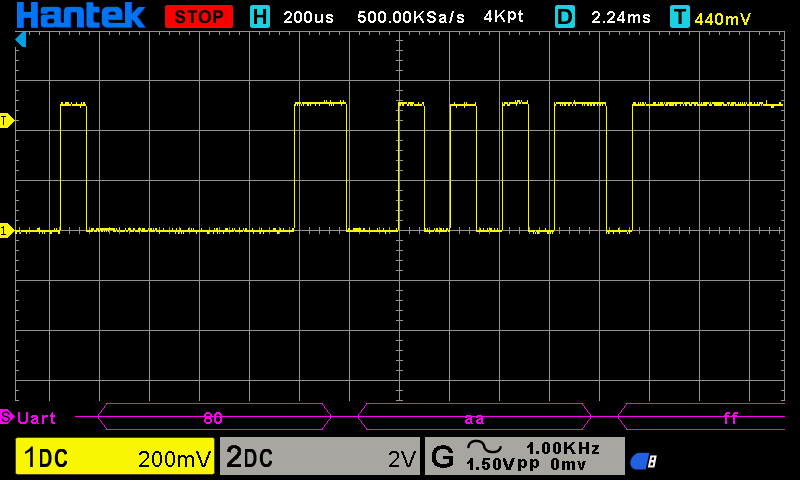

# RS232 Transmission
16/Jul/2023

## Windows 
### Connection
USB-SERIAL CH340 adapter pinout:
- 2 RX
- 3 Tx
- 5 GND


### Sending data
Python example to write data to the serial port from Windows:
```python
import serial
import time

ser = serial.Serial(
    port='COM3',\
    baudrate=9600,\
    parity=serial.PARITY_NONE,\
    stopbits=serial.STOPBITS_ONE,\
    bytesize=serial.EIGHTBITS,\
    timeout=0)

while(1):
    ser.write(b'\x00\x80\xaa\xff')
    time.sleep(1)

ser.close()
```

### Waveforms
In this adapter, the idle level is low:


## Arduino Duemilanove

### Connection
Digital pin 1 and gnd.

### Sending data 
Arduino example to write to the serial port:
```arduino
void setup() {
  Serial.begin(9600);
}

void loop() {
  char data[4] = {0x0, 0x80, 0xaa, 0xff};
  Serial.write(data, 4);
  delay(500);
}
```
### Waveforms
Idle level is high:



