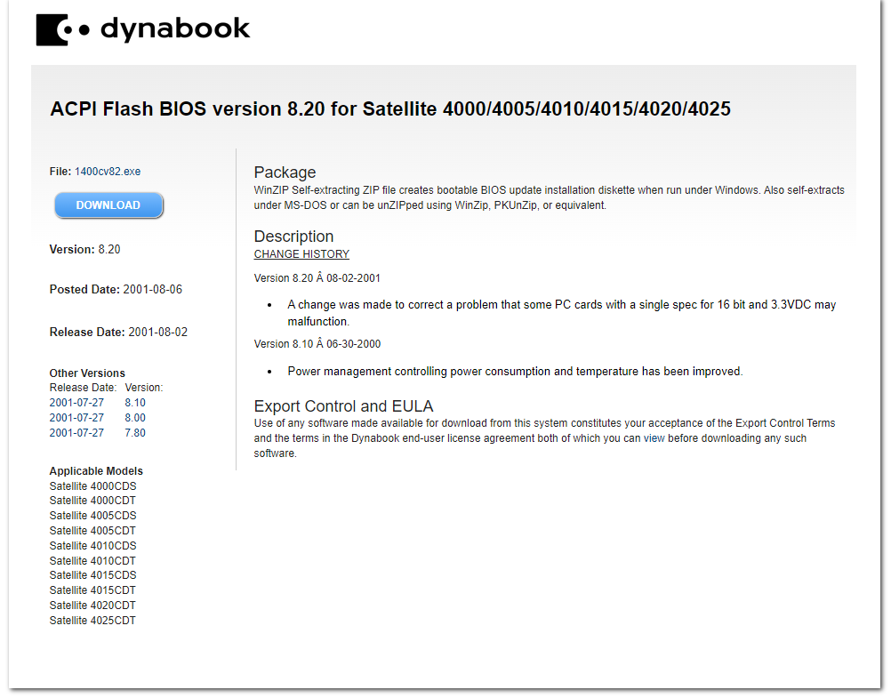

# Toshiba Satellite 4000CDT
10/Jan/2024

# Identification Label
    TOSHIBA
    4000CDT/4.0 SYSTEM YBUT
    MODEL NO. PA1273E YXCD
    DC 15V
    3.0 A
    SERIAL NO. X8040988

Manufacture year: 1997

# Useful links:
- https://www.computinghistory.org.uk/det/46780/Toshiba-Satellite-S4000CDS-4-0/
- https://archive.org/details/4000-4010-4020-rc-2-win-98-disc-1


## Error Messages (so far...)
### Stuck in CMOS
    **** Bad check sum (CMOS) ****
    Check system. Then press [F1] key.

Not sure if F1 key works, I press and it does nothing.


## Key combinations

### Ctrl + Alt + Del
Restart the laptop.

### Tab
The message:

    Ready for EC/KBC update. Place the EC/KBC update diskette in the drive, and press any key when ready to proceed

is displayed with the following steps:
1. Power off the unit.
2. Press and hold **Tab**
3. Press the power button to turn on the computer
4. The following message is displayed:

### F12
The message:

    Ready for BIOS update. Place the BIOS update diskette in the drive, and press any key when ready to proceed.

is displayed with the following steps:
1. Power off the unit.
2. Press and hold **F12**
3. Press the power button to turn on the computer
4. The following message is displayed:

I was able to find and generate a workable update diskette using [1400cv82.exe](1400cv82.exe)

Unfortunatelly the link from support is broken: https://support.dynabook.com/support/viewContentDetail?contentId=120386



#### Bios README.TXT
```
README.TXT                                                     08-04-2001 CDC
Flash BIOS version 8.20 for Satellite 4000C Series
=============================================================================

This BIOS is applicable to the following models:

Satellite 4000CDS
Satellite 4000CDT
Satellite 4005CDS
Satellite 4005CDT
Satellite 4010CDS
Satellite 4010CDT
Satellite 4015CDS
Satellite 4015CDT
Satellite 4020CDT
Satellite 4025CDT

For purposes of this document, the term "Satellite 4000C Series"
is used to generically refer to all of the models listed above.
=============================================================================

This archive contains the following files:

README.TXT      Installation/usage instructions in ASCII text format
README.COM      Self-displaying version of installation/usage instructions
1117D820.EXE    Self-extracting diskette image of BIOS install diskette
BIOFC19T.COM    Flash BIOS 8.20 image for Satellite 4000C Series
                (provided here for installation methods 2 and 3)
CHGBIOSA.EXE    Flash BIOS update utility version 4.02
                (provided here for installation methods 2 and 3)
INSTINFO.BAT    DOS batch file that creates install disk and displays README
                file

This BIOS version is Windows 2000 compatible and supports Plug and Play,
and ACPI functionality.

********************************** CAUTION! *********************************
*****************************************************************************

During the upgrading of your computers BIOS, if the computer loses power or
fails to complete the process of upgrading the BIOS, the existing BIOS in
the computer may become damaged. In the event of this occurring, the
BIOS Key Installation Method, described below, can be used to recover from
this error condition.

If you are upgrading a number of computers with this BIOS, the BIOS Key
installation method is the quickest.

It is recommended that all PCMCIA cards be removed from the system prior to
upgrading the BIOS.  Also recommended is detaching the computer from any
docking device (Desk Station, port replicator, etc.) which may be attached.

It is not unusual to see a CMOS error when you first reboot the computer after
installing the new BIOS.  If you see this message on your screen, press F1 as
instructed.  This displays the "TSETUP" screen. Press <End> to save the CMOS
data.  You won't see the CMOS error again.


******************** BIOS INSTALLATION INSTRUCTIONS *************************
*****************************************************************************

There are three ways to install this BIOS version:

1) Use the bootable diskette that is automatically created by the Windows
   UnZip process (Recommended)

2) At startup by holding down the F12 key.

3) Run CHGBIOSA.EXE at the command prompt.

*****************************************************************************


1) BOOT DISKETTE INSTALLATION METHOD (Recommended)
--------------------------------------------------

This release of the electronic distribution BIOS utilizes a self-extracting
ZIP file that, when run under Windows or Win-OS2, creates a bootable BIOS
installation diskette.

Since you're reading this, you were obviously able to extract the downloaded
file.  If you also created the BIOS installation diskette as a part of the
extraction process, you're ready to follow the installation instructions
below.

If you didn't create the installation diskette during the extraction phase,
or if you extracted the downloaded file with PKUnZip or WinZip, you can
create the installation diskette by executing the INSTINFO program from the
DOS command prompt.

Install this BIOS using the following steps:

WINDOWS 9x, Me, 2000, NT:

      o Close all open programs
      o Insert the BIOS installation diskette into your diskette drive (A:)
      o Click Start
      o Click Shutdown
      o Click the radio button next to "Restart the computer?"
      o Click Yes

WINDOWS 3.x:

      o Close all open programs
      o From Program Manager, click on File/Exit Windows
        Windows exits to a MS-DOS command prompt
      o Insert the BIOS installation diskette into your diskette drive (A:)
      o Press Ctrl-Alt-Del (press and hold the <Ctrl> and <Alt> keys and press
        the <Del> key) to restart the system

OTHER OPERATING SYSTEMS

      o Close all open programs
      o Shut down the operating system
      o Insert the BIOS installation diskette into your diskette drive (A:)
      o Restart the computer by pressing Ctrl-Alt-Del or turning the computer
        OFF then on again

The computer will boot MS-DOS from the BIOS installation diskette, and
initiate the Flash BIOS installation routine.  When the Flash BIOS
installation is complete, the success message is displayed:


        Please push the RESET SW (or turn AC power OFF/ON) to restart!

                             ROM Write Successful!
                               Utility Finished!


Eject the diskette from drive A: and turn the computer OFF then ON, or press
the reset switch to restart your computer.


ADDITIONAL INFORMATION REGARDING THIS RELEASE
---------------------------------------------

If you are unable to use the Windows self-extractor, the self-extracting
ZIP archive can be extracted by executing it from a DOS prompt or it can be
extracted using PKUNZIP 2.04G or an equivalent UnZIP utility.  A DOS batch
file, INSTINFO.BAT is provided in the ZIP archive which will create the BIOS
installation diskette.  If all else fails, you can execute the
self-extracting diskette image manually.  This file is named 1117D820.EXE, and
needs a parameter of A: (1117D820 A:) to successfully create the diskette in
drive A:

The self-extracting diskette image, 1117D820.EXE, will run under MS-DOS or a
command prompt under Windows 9x, Me, 2000, NT, or OS/2.  PLEASE NOTE that long
directory names in  the path where the self-extracting image file is stored
under Windows 9x or NT/2K will cause the self-extracting image to abort.  Long
directory names are supported under OS/2.


2) BIOS KEY INSTALLATION METHOD
---------------------------

Your Toshiba computer has a special keyboard function to install an
updated BIOS image.

To use this function, hold down the F12 key while the computer is
powered on.  The computer MUST be in BOOT mode, not Resume mode.

This installation method will only work with the internal keyboard.  If
your computer is docked with the display closed and you are using an external
keyboard, the computer will need to be undocked and the internal keyboard's
F12 key used.

When the computer starts up with the F12 key depressed, the following
message appears:

'Ready for BIOS update. Place the BIOS diskette in the drive, and press
any key when ready to proceed.'

Insert the diskette that contains CHGBIOSA.EXE and BIOFC19T.COM,
and press any key.  The CHGBIOSA program will automatically load the
BIOFC19T.COM file.

3) RUN CHGBIOSA.EXE AT THE COMMAND PROMPT
-----------------------------------------

The CHGBIOSA program is designed to be run from the MS-DOS command
prompt.  It cannot be run in a DOS box inside of Windows 3.x, Windows 9x,
OS/2 or other operating systems.  It also will not run if a Memory Manager,
like EMM386, is loaded.  The CHGBIOSA program can be run from a
floppy disk, hard drive, or PCMCIA drive.  However, you will need a floppy
diskette (high or low density) in your A: drive at the time the CHGBIOSA
program is run.

When the CHGBIOSA program is executed by itself, it will prompt you
to specify where the BIOS image file, BIOFC19T.COM is located.  Enter
the complete path and file name. Example: C:\1400CV82\BIOFC19T.COM.

NOTE!
-----

If your path for BIOFC19T.COM is anywhere other than the root directory
of the A: drive (A:\BIOFC19T.COM), CHGBIOSA will copy the BIOS image
file from its current location to the root directory of A: drive.


Optionally, the CHGBIOSA program can also be run from a single command
which includes the path to the BIOFC19T.COM file.

   Example: CHGBIOSA C:\1400CV82\BIOFC19T.COM


CHANGE HISTORY
--------------

Version 8.20  08-02-2001
  o  A change was made to correct a problem that some PC cards with a
     single spec for 16 bit and 3.3VDC may malfunction.


Version 8.10  06-30-2000
  o  Power management controlling power consumption and temperature has
     been improved.


Version 8.00  02-08-2000
  o  A change was made to support Windows 2000.
  o  Corrected a problem where having the "USB Legecy=Enabled" set in the
     BIOS, and entering some keys on a Japanese USB keyboard, was
     impossible.
  o  Correct a rare problem when printing a text file from a DOS shell in
     Windows 95.
  o  Corrected a rare problem witht eh HDD password.  When the HDD password
     was registered, and the computer set to standby mode, resuming the
     computer would lead to a blue screen error.
  o  Corrected a problem when running Windows 2000.  If VGA segment address
     was set to E4000h, a blue screen error would occur
  o  Corrected a problem while running the HCT test.  In the ACPI test, the
     CPU Throttle subtest would result in a false error.
  o  Corrected a problem while running the HCT test.  In the ACPI Test,
     executing the USB subtest would result in a false error.
  o  When copying a file from a 120MB FDD, using a Super Disk (LS-120),
     while running Windows 95/98, and then attempting to open that file
     under DOS mode, caused files, in excess of 50MB, to be corrupted.
  o  Corrected a problem where having the "USB Legecy=Enabled" set in the
     BIOS, and entering the "Pause" key several times caused the key to
     repeat on it's own.
  o  Corrected a problem when the Power ON/OFF was set to Enable, and
     system goes into Hibernation with the LCD panel closed. If  an AC
     Adaptor was connected after opening the display panel,  the computer
     would "wake up" on its own.
  o  Corrected a problem of installing a driver from the FDD.  Installing a
     driver was impossible when a new device was detected during Windows 98
     installation.
  o  Corrected a problem that when, after preinstalling Windows 95/98,
     executing hibernation without shutting down the system resulted in
     intermittent hibernation error.
  o  The control method of the system status (Sx) was changed.


Version 7.80  02-22-1999
  o  Corrected a problem in Windows '98 with a hang when operating under
     ACPI mode.  C3 state function was disabled completely.


Version 7.70  12-07-1998
  o  Corrected a problem where the system would hang under ACPI mode of
     Win98 when going into a C3 state.
  o  Corrected a problem with systems using a Sharp LCD, where the entire
     screen becomes white when it is set to standby mode.
  o  Corrected a problem where, when using an incorrect key floppy
     diskette, the password would be canceled.
  o  Corrected a problem where, after hibernation is executed one time, the
     hibernation will continue to work even though the hibernation setting
     was canceled.
  o  Corrected a problem where some PC cards don't work under Win2000.
     This is caused by a mis-match of PCMCIA data between the IRQ routing
     table and the hardware.
  o  Corrected a problem where suspending or resuming the system under
     Win95 or Win98 would lead to an all white or all black LCD.


Version 7.60  09-09-1998
  o  On the Satellite 4020, the time from power-on to receiving the
     external KB initialization end code was shortened to 2.5 seconds.
  o  Corrected a problem with the system hanging during the power on
     sequence if the system is set to CardBus/16 bit mode, with an R2 card
     (such as a modem card) installed in the system.
  o  Corrected a problem where, under Windows NT, disconnecting the AC
     adapter with the system set to Display Auto Off, the display would
     turn on.
  o  Corrected a possible problem with a system shutdown, even if the CPU
     module's ambient temperature does not reach the point of system
     shutdown.


Version 7.40  11-18-1998
  o  Initial Production BIOS for Satellite 4000/4005


 **end**


```
