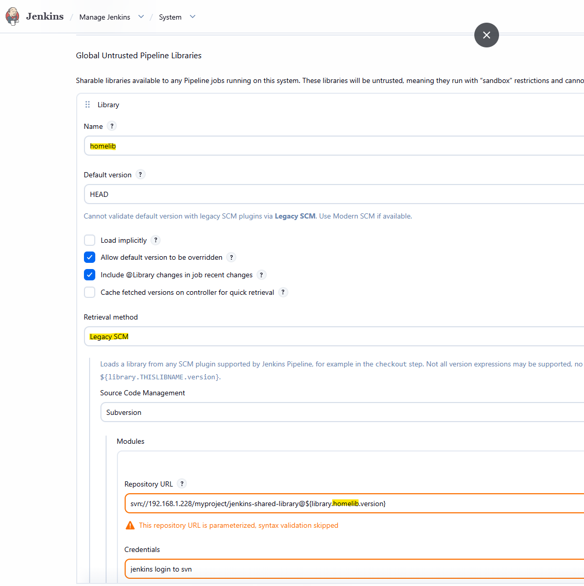

# Jenkins Utilities
22/Jul/2026

## Shared Library
- Retrieval method: `Legacy SCM`
- Repository URL: `svn://192.168.1.228/myproject/jenkins-shared-library@${library.homelib.version}`



- Include the library in Jenkinsfile like:

        @Library('homelib@25') _
           or 
        @Library(value='homelib@25', changelog=false) _

## Node setup
The node work dir is C:\jenkins
Download [/winswhttps://github.com/winsw](https://github.com/winsw/winsw/releases/) to C:\jenkins and rename to jenkins-agent.exe
Create an xml with the service config
```
<service>
  <id>jenkins-agent</id>
  <name>Jenkins Agent (windao)</name>
  <description>Jenkins inbound agent</description>
  <executable>C:\Program Files\Eclipse Adoptium\jdk-17.0.x-hotspot\bin\java.exe</executable>
  <arguments>-jar "C:\jenkins\agent.jar" -url http://192.168.1.227:8080/ -secret @C:\jenkins\secret-file -name windao -webSocket -workDir "C:\jenkins"</arguments>
  <workingdirectory>C:\jenkins</workingdirectory>
  <logmode>rotate</logmode>
  <onfailure action="restart" delay="10 sec"/>
</service>
```
cd C:\jenkins
jenkins-agent.exe install
jenkins-agent.exe start

Adjust the user it is running as:
Open services.msc → Jenkins Agent → Log On tab → set it to run as your tool account. Otherwise builds fail with missing-tool or license errors.


### Mount a folder to first drive available

- Maps `folderPath` to the first free letter from `driveLetters` using `subst`, on a Windows agent.
- Order of checks: path exists -> not already mounted -> compute free letters from `fsutil fsinfo drives` -> mount first free candidate.
- Returns the mounted drive letter (e.g. `E:`) or calls `error()` with the reason (`invalid path`, `already mounted`, `no drive available`).

```groovy
def mountFirstAvailableDrive(String folderPath, List<String> driveLetters) {
    if (!fileExists(folderPath)) {
        error "Invalid path: '${folderPath}' does not exist"
    }

    def substOutput = bat(script: '@subst', returnStdout: true).trim()
    def existingMapping = substOutput.readLines().find {
        it.toLowerCase().contains(folderPath.toLowerCase())
    }
    if (existingMapping) {
        error "Folder '${folderPath}' is already mounted: ${existingMapping}"
    }

    def fsInfo = bat(script: '@fsutil fsinfo drives', returnStdout: true).trim()
    def usedDrives = (fsInfo =~ /([A-Za-z]):\\/).collect { it[1].toUpperCase() }

    def candidates = driveLetters.collect { it.replace(':', '').trim().toUpperCase() } - usedDrives
    if (candidates.isEmpty()) {
        error "No drive available from ${driveLetters}: all candidates are in use"
    }

    for (letter in candidates) {
        def script = """@echo off
if exist ${letter}:\\ (
    echo USED
) else (
    subst ${letter}: "${folderPath}"
    echo MOUNTED
)"""
        def result = bat(script: script, returnStdout: true).trim()
        if (result.endsWith('MOUNTED')) {
            return "${letter}:"
        }
    }

    error "No drive available from ${driveLetters}: all candidates were taken by the time of mounting"
}
```

### Unmount a folder

- Receives a `driveLetter` (e.g. `E:` or `E`), checks it is really mounted via `subst`, then removes it with `subst /D`.
- If `driveLetter` is omitted/blank, falls back to `env.WORK_DRIVE` — and in that case the token check is **mandatory**, checked against `env.BUILD_URL`, since relying on ambient env state instead of an explicit argument deserves the stricter check. There's no separate `env.MOUNT_TOKEN` to track — the token is always just `env.BUILD_URL`, both when it's written by `mountFirstAvailableDrive` and when it's checked here.
- When an explicit `driveLetter` is passed instead, no token check runs at all — the caller might legitimately be unmounting a drive that wasn't mounted through this token-writing flow at all, so there'd be nothing to compare against.
- Logs and does nothing if the letter is not currently mounted, instead of failing the build.
- A mismatch means something else forcibly removed and remounted (or swapped) that letter in between, so it refuses to blindly `/D` it and fails loudly instead; because the token is a build URL, not a random value, whatever's actually sitting in the file directly identifies the other build that now owns that letter.
- Clears `env.WORK_DRIVE` after a successful unmount — otherwise it lingers as pipeline-global env for the rest of the build and would trip `mount_drive.bat`'s own `if defined WORK_DRIVE` guard on any later mount attempt, even though nothing is actually still mounted.

```groovy
def unmountDrive(String driveLetter = '') {
    def usingWorkDrive = (!driveLetter?.trim()) || ("${driveLetter.trim()}" == env.WORK_DRIVE)
    def letter = (usingWorkDrive ? env.WORK_DRIVE : driveLetter)?.trim()?.toUpperCase()
    if (!letter) {
        error "unmountDrive: no drive letter given and env.WORK_DRIVE is not set"
    }

    def substOutput = bat(script: '@subst', returnStdout: true).trim()
    def existingMapping = substOutput.readLines().find {
        it.toUpperCase().startsWith("${letter}\\")
    }
    if (!existingMapping) {
        echo "Drive '${letter}' is not mounted."
        return
    }

    if (usingWorkDrive) {
        def tokenOnDisk = bat(
            script: "@type \"${letter}\\.jenkins_mount_token\" 2>nul",
            returnStdout: true
        ).trim()
        if (tokenOnDisk != env.BUILD_URL) {
            error "unmountDrive: refusing to unmount ${letter}: - token mismatch (expected '${env.BUILD_URL}', found '${tokenOnDisk}')"
        }
        bat "@del /f /q \"${letter}:\\.jenkins_mount_token\""
    }

    bat "@subst ${letter} /D"
    env.WORK_DRIVE = null
}
```

### Export from svn

- Runs the real `svn export` CLI (no `.svn` metadata, always a clean overwrite), exposing only `url`, `revision` and `localPath`.
- Prepends the known Cygwin `bin` folder to `PATH` via `withEnv` so the same known-good `svn.exe` is always the one resolved, regardless of what else is on the node's `PATH`.
- Validates `url`, `revision` and `localPath` before building the command line, so untrusted values can't break out of the intended arguments.
- Usage: `svnCheckout('http://repo.url/app.exe', '1234', 'some/relative/path/app.exe')`

```groovy
def svnCheckout(String url, String revision, String localPath) {
    def cygwinBin = 'C:\\cygwin64\\bin'

    if (!(revision ==~ /^(HEAD|[0-9]+)$/)) {
        error "Invalid revision: '${revision}'"
    }
    if (!(url ==~ /^(https?|svn|svn\+ssh):\/\/[\w\-.\/:@%]+$/)) {
        error "Invalid svn url: '${url}'"
    }
    if (!(localPath ==~ /^[\w\-.\/\\: ]+$/)) {
        error "Invalid local path: '${localPath}'"
    }

    withEnv(["PATH+CYGWIN=${cygwinBin}"]) {
        bat "svn export --force -r ${revision} \"${url}\" \"${localPath}\""
    }
}
```


### WithEnv

- Runs `setupScript` once in a throwaway `bat` call, dumps the resulting environment with `set`, and re-applies every `KEY=VALUE` pair via `withEnv` around `body`.
- Because `withEnv` re-injects its vars into every `bat` step it wraps, all calls inside `body` (e.g. `svn_export.bat`, `build.bat`) see the same environment the setup script produced, without re-running it each time.
- Usage:

```groovy
withSetupEnv('C:\\tools\\set_env_default.bat') {
    bat 'svn_export.bat "http://repo.url/app.exe" 1234 "some\\path\\app.exe"'
    bat 'build.bat'
}
```

```groovy
def withSetupEnv(String setupScript, Closure body) {
    def script = """@echo off
call "${setupScript}"
set"""
    def output = bat(script: script, returnStdout: true).trim()

    def envVars = output.readLines().findAll { it ==~ /^[A-Za-z_][A-Za-z0-9_]*=.*/ }

    withEnv(envVars) {
        body()
    }
}
```

### Setup env once (global for the whole pipeline)

- Runs `setupScript` a single time and writes each resulting `KEY=VALUE` straight into the pipeline's global `env` object, instead of scoping them to a closure.
- Vars set on `env` persist for the rest of the build and are injected into every later `bat`/`sh` step automatically, so callers don't need to wrap anything — call this once near the top of the Jenkinsfile.
- Guards against re-running the setup script if called more than once, via the `SETUP_ENV_DONE` sentinel.
- Usage:

```groovy
setupEnvOnce('C:\\tools\\set_env_default.bat')

bat 'svn_export.bat "http://repo.url/app.exe" 1234 "some\\path\\app.exe"'
bat 'build.bat'
```

```groovy
def setupEnvOnce(String setupScript) {
    if (env.SETUP_ENV_DONE == 'true') {
        return
    }

    def script = """@echo off
call "${setupScript}"
set"""
    def output = bat(script: script, returnStdout: true).trim()

    output.readLines().findAll { it ==~ /^[A-Za-z_][A-Za-z0-9_]*=.*/ }.each { line ->
        def (key, value) = line.split('=', 2)
        env."${key}" = value
    }

    env.SETUP_ENV_DONE = 'true'
}
```

- Minimum pipeline showing the vars set in the first stage are still there in the second:

```groovy
pipeline {
    agent any

    stages {
        stage('Setup') {
            steps {
                script {
                    setupEnvOnce('C:\\tools\\set_env_default.bat')
                }
            }
        }

        stage('Show env') {
            steps {
                bat 'set'
            }
        }
    }
}
```

## Replacement bat files

### mount_drive.bat

```bat
@echo off

if defined WORK_DRIVE ( goto :ALREADY_SET )

set "FOLDER=%~f1"
if "%FOLDER%"=="" set "FOLDER=%CD%"
if not exist "%FOLDER%\" ( goto :NOT_EXIST )

set "DRIVES=%2"
if "%DRIVES%"=="" set "DRIVES=F G H I J"

subst | findstr /I /E /C:"%FOLDER%" > nul
if %ERRORLEVEL% EQU 0 ( goto :ALREADY_MOUNTED )

for %%A in (%DRIVES%) do (
    if not exist %%A: (
        subst %%A: "%FOLDER%" > nul 2>&1
        REM check to see if we actually won the drive letter since other process could have taken it in the meantime
        subst | findstr /I /X /C:"%%A:\: => %FOLDER%" > nul
        if not errorlevel 1 (
            set "WORK_DRIVE=%%A:"
            goto :SUCCESS
        )
	)
)
goto :NOT_AVAILABLE

REM the output messages may be parsed so they must have a consistent format to make it easier
:SUCCESS
echo [%~n0] OK: %WORK_DRIVE% points to "%FOLDER%". && exit /b 0
:ALREADY_SET
echo [%~n0] ERROR: WORK_DRIVE set to %WORK_DRIVE%. Unmount first! && exit /b 1
:NOT_EXIST
echo [%~n0] ERROR: '%FOLDER%' does not exist. && exit /b 2
:ALREADY_MOUNTED
echo [%~n0] ERROR: '%FOLDER%' already mounted. && exit /b 3
:NOT_AVAILABLE
echo [%~n0] ERROR: '%DRIVES%' not available. && exit /b 4


```

### Jenkins wrapper for mount_drive.bat

- Thin wrapper: validates `folderPath` and `driveLetters` in Groovy, then delegates the actual check/parse/subst logic to `mount_drive.bat`.
- `driveLetters` is a plain space-separated string of bare letters, e.g. `"A B C D"` — the `:` needed by `mount_drive.bat`'s own `exist`/`subst` checks is appended once, right when building the argument string.
- Chains `&& set WORK_DRIVE` onto the same `bat` invocation instead of parsing any of `mount_drive.bat`'s own echoed text — `set WORK_DRIVE` prints exactly one `WORK_DRIVE=<letter>:` line when the mount succeeded, so there's no custom marker/prefix to parse. A second, separate `bat` call couldn't do this instead: each `bat` step is a fresh `cmd.exe`, so a variable set by `mount_drive.bat` wouldn't survive into a later step.
- Uses plain `returnStdout: true` — no `returnStatus`, no manual exit-code check. If `mount_drive.bat` fails, `&&` skips `set WORK_DRIVE`, the compound command's exit code stays non-zero, and Jenkins aborts the step (and build) on its own; there's nothing to recover from, so there's no reason to intercept that. `mount_drive.bat`'s own `ERROR: ...` line is still visible in the Jenkins console log regardless, since step output streams live independent of `returnStdout`.

```groovy
def mountFirstAvailableDrive(String folderPath, String driveLetters) {
    if (!(folderPath ==~ /^[\w\-.\/\\: ]+$/)) {
        error "Invalid path: '${folderPath}'"
    }
    if (!(driveLetters.trim() ==~ /^[A-Za-z](\s+[A-Za-z])*$/)) {
        error "Invalid drive letters: '${driveLetters}' (expected e.g. 'A B C D')"
    }

    def drivesArg = driveLetters.trim().split(/\s+/).collect { "${it.toUpperCase()}:" }.join(' ')

    def output = bat(
        script: "@call \"C:\\tools\\mount_drive.bat\" \"${folderPath}\" \"${drivesArg}\" && set WORK_DRIVE",
        returnStdout: true
    ).trim()

    def drive = output.readLines().find { it.startsWith('WORK_DRIVE=') }?.substring('WORK_DRIVE='.length())
    if (!drive) {
        error "mountFirstAvailableDrive: could not read WORK_DRIVE from output: ${output}"
    }

    def token = env.BUILD_URL
    bat "@echo ${token}> \"${folderPath}\\.jenkins_mount_token\""

    env.WORK_DRIVE = drive
    return drive
}
```

### Interaction

```
def cancelled = false
try {
    timeout(time: 10, unit: 'MINUTES') {
        input message: 'Integrating to trunk. Abort within 10 min to cancel.',
              ok: 'Cancel merge'
        cancelled = true            // only reached if a human clicks Cancel
    }
} catch (org.jenkinsci.plugins.workflow.steps.FlowInterruptedException e) {
    cancelled = false               // window elapsed -> proceed
}

// =============================================================================
// Gate / hand-over pipeline (Windows agent, SVN backend)
//
// Moves a branch:  wip/<branch>  ->  gate/<branch>  ->  trunk (+ merged/<branch>)
//
//   - Build & test steps are PLACEHOLDERS (echo). Swap in your real toolchain.
//   - All SVN operations are REAL.
//   - The claim-move (wip -> gate) is the per-branch mutex: it is a single
//     atomic server-side rename, so a second trigger for the same branch cannot
//     succeed (wip/<branch> no longer exists). The Pre-check stage turns that
//     hard failure into a friendly message BEFORE attempting the move.
//   - Global lock('trunk-integration') serializes DIFFERENT branches touching
//     trunk. It is held only for the short checkout->commit window, NOT during
//     the 10-min regret timer, so the timer does not block other integrations.
//   - On failure, only CLEAN verdicts (cancel / merge-conflict / out-of-date
//     commit) auto-return the branch to wip/. Infra/unknown failures LEAVE the
//     branch stranded in gate/ and alert — repo state is the source of truth.
// =============================================================================

def SVN        = 'svn'                       // use an ABSOLUTE path if the agent PATH is unreliable
def REPO       = 'svn://your-server/repo'
def LOCK       = 'trunk-integration'
def REGRET_MIN = 10
def WC         = 'C:\\ci\\t'                  // deliberately SHORT: dodges MAX_PATH on embedded trees

properties([
  parameters([
    string(name: 'WIP_BRANCH', defaultValue: '',
           description: 'Branch path under wip/, e.g. alice/add-uart')
  ])
])

node('windows') {

  if (!params.WIP_BRANCH?.trim()) { error 'WIP_BRANCH is required.' }
  def branch    = params.WIP_BRANCH.trim().replaceAll('^/+', '').replaceAll('/+$', '')
  def wipUrl    = "${REPO}/wip/${branch}"
  def gateUrl   = "${REPO}/gate/${branch}"
  def mergedUrl = "${REPO}/merged/${branch}"
  def trunkUrl  = "${REPO}/trunk"

  // svn helpers. '@' suppresses cmd echoing the command, so returnStdout is clean svn output.
  def svnRc  = { String a -> bat(returnStatus: true, script: "@${SVN} ${a}") }        // exit code, never throws
  def svnOut = { String a -> bat(returnStdout: true, script: "@${SVN} ${a}").trim() } // stdout, throws on non-zero

  boolean landed = false   // did the change actually reach trunk?

  // -------------------------------------------------------------------------
  stage('Pre-check') {
    // Already being integrated?  (claim-move already happened for this branch)
    if (svnRc("info \"${gateUrl}\"") == 0) {
      error "REJECTED: '${branch}' is already in gate/ — an integration is in " +
            "progress. Wait for it to land in merged/ or be returned to wip/. " +
            "Do NOT re-trigger."
    }
    // Already integrated and closed?
    if (svnRc("info \"${mergedUrl}\"") == 0 && svnRc("info \"${wipUrl}\"") != 0) {
      error "REJECTED: '${branch}' is already in merged/ — nothing to integrate."
    }
    // The WIP branch must exist to claim it.
    if (svnRc("info \"${wipUrl}\"") != 0) {
      error "REJECTED: no branch at ${wipUrl}. Check the WIP_BRANCH value."
    }
  }

  // -------------------------------------------------------------------------
  stage('Claim (wip -> gate)') {
    // Atomic rename = the real mutex. If a concurrent trigger beat us here,
    // wip/<branch> is gone and this returns non-zero -> reject cleanly.
    if (svnRc("move \"${wipUrl}\" \"${gateUrl}\" -m \"Claim ${branch} for gating\"") != 0) {
      error "REJECTED: could not claim '${branch}' (already claimed, or race lost)."
    }
  }

  // From here on, a failure can strand the branch in gate/, so wrap everything.
  try {

    // -----------------------------------------------------------------------
    boolean cancelled = false
    stage('Verify + regret window') {
      parallel(
        'build-test': {
          // ---- PLACEHOLDERS: pretend the merged result builds & tests green ----
          bat 'echo [BUILD] compiling merged result ... OK'
          bat 'echo [TEST]  running unit tests    ... OK'
        },
        'regret': {
          // NOTE: for production, move this input OUTSIDE the node block so it
          // does not hold an executor for 10 min. Inline here for a readable example.
          try {
            timeout(time: REGRET_MIN, unit: 'MINUTES') {
              input message: "Integrating '${branch}' to trunk. " +
                             "Abort within ${REGRET_MIN} min to cancel.",
                    ok: 'Cancel merge'
              cancelled = true   // reached ONLY if a human clicks 'Cancel merge'
            }
          } catch (org.jenkinsci.plugins.workflow.steps.FlowInterruptedException e) {
            // Distinguish "timer elapsed" (proceed) from "job aborted" (abort everything).
            boolean timedOut = e.causes.any {
              it instanceof org.jenkinsci.plugins.workflow.steps.TimeoutStepExecution.ExceededTimeout
            }
            if (timedOut) {
              cancelled = false        // window elapsed -> proceed to integrate
            } else {
              throw e                  // genuine abort -> propagate; catch/return handles branch
            }
          }
        }
      )
    }

    if (cancelled) {
      stage('Cancelled -> return to wip') {
        svnRc("move \"${gateUrl}\" \"${wipUrl}\" " +
              "-m \"Cancelled within regret window; return ${branch} to wip\"")
        currentBuild.result = 'ABORTED'
        error "Cancelled by user; '${branch}' returned to wip/."
      }
    }

    // -----------------------------------------------------------------------
    stage('Integrate to trunk') {
      lock(LOCK) {   // held only for this short window; other branches wait here, not during regret
        bat "if exist \"${WC}\" ( ${SVN} cleanup \"${WC}\" & rmdir /s /q \"${WC}\" )"
        bat "${SVN} checkout \"${trunkUrl}\" \"${WC}\""

        dir(WC) {
          // Real merge of the gated branch into a fresh trunk WC at HEAD.
          // --accept postpone returns 0 even with conflicts; svn prints a
          // "Summary of conflicts" line to stdout when any occurred.
          def mergeOut = svnOut("merge --accept postpone \"${gateUrl}\" .")
          echo mergeOut
          if (mergeOut.contains('Summary of conflicts')) {
            bat "${SVN} revert -R ."
            // CLEAN verdict (rejection): safe to auto-return to wip.
            svnRc("move \"${gateUrl}\" \"${wipUrl}\" " +
                  "-m \"Merge conflict vs trunk; return ${branch} to wip\"")
            error "REJECTED: '${branch}' conflicts with current trunk. " +
                  "Sync trunk into your branch, resolve, then re-hand-over."
          }

          // ---- PLACEHOLDERS: authoritative build & test of the merged trunk ----
          bat 'echo [BUILD] compiling merged trunk ... OK'
          bat 'echo [TEST]  running tests on trunk ... OK'
          // In real life: on non-zero -> `svn revert -R .`, move gate->wip, error (CLEAN verdict).

          // Commit trunk. Out-of-date -> nothing landed -> safe to auto-return.
          if (svnRc("commit -m \"Gated merge of ${branch} (verified)\"") != 0) {
            bat "${SVN} revert -R ."
            svnRc("move \"${gateUrl}\" \"${wipUrl}\" " +
                  "-m \"Trunk commit failed (out-of-date?); return ${branch}\"")
            error "Trunk commit failed (likely out-of-date). " +
                  "'${branch}' returned to wip/; re-hand-over."
          }
          landed = true   // <-- past this line, the change IS on trunk
        }
      }
    }

    // -----------------------------------------------------------------------
    stage('Archive (gate -> merged)') {
      if (svnRc("move \"${gateUrl}\" \"${mergedUrl}\" -m \"Integrated ${branch} to trunk\"") != 0) {
        // Trunk already has the change: do NOT return to wip. Leave in gate/, flag for human.
        currentBuild.result = 'UNSTABLE'
        echo "POST-COMMIT: trunk updated but archive move failed. " +
             "'${branch}' left in gate/ for MANUAL archival to merged/. Do NOT return to wip."
        // TODO: notify ops here.
      }
    }

  } catch (err) {
    // Trust repo state, not flags: is the branch still stranded in gate/?
    boolean stillInGate = (svnRc("info \"${gateUrl}\"") == 0)
    if (stillInGate && !landed) {
      // Infra / unknown failure before any verdict: leave it, alert. Never auto-return here.
      echo "INFRA/UNKNOWN failure before a verdict. Leaving '${branch}' in gate/ " +
           "for a human. NOT auto-returning to wip/."
      // TODO: notify ops here.
    }
    throw err
  }
}
```


## Retriving data
Auth (almost always needed). Use an API token, not your password — generate it under User → Configure → API Token.

```
# wget
wget --auth-no-challenge --user=<user> --password=<api_token> \
     https://jenkins.example/job/app-fw/512/artifact/build/firmware.bin

# curl (often cleaner)
curl -fsSL -u <user>:<api_token> \
     https://jenkins.example/job/app-fw/512/artifact/build/firmware.bin -o firmware.bin
```


Finding the exact path programmatically — the build's JSON API lists artifacts:
```
bash
curl -s -u <user>:<tok> \
  "https://jenkins.example/job/app-fw/512/api/json?tree=artifacts[relativePath]"
```

### Artifactory replacement
| **Artifactory feature**            | **Useful?**        | **Minimal equivalent**                                        |
| ---------------------------------- | ------------------- | ------------------------------------------------------------------ |
| Content-addressed store + dedup    | **Yes - core**      | file-per-key JSON, sharded dir                                     |
| Properties / metadata on artifacts | **Yes**             | the JSON record fields                                             |
| Build Info (CI → artifact linkage) | **Yes**             | Jenkins writes commit + build # into the record                    |
| Search / query (AQL)               | Light               | dict lookup by key; filter by tag/date in Python                   |
| Immutability / retention           | **Yes**             | append-only records, never rewrite; VCS history is the audit trail |
| Checksum verification              | Optional            | recompute CRC over region vs stored field                          |
| Promotion / staging (dev→release)  | Optional            | a status field or rc/release/ subdirs                              |
| Binary storage / re-download       | Optional            | bins kept as jenkins artifacts                                     |
| Access control                     | **Skip**            | VCS repo permissions cover it                                      |
| REST API / web UI                  | **Skip**            | CLI + git/svn                                                      |
| Replication / HA                   | **Skip**            | the VCS repo is already distributed                                |
| Virtual/remote repos, proxying     | **Skip**            | irrelevant to your use case                                        |

Stored in jenkins as

      ARTIFACT_REL="build/load_package.bin"       # path relative to archive root
      ARTIFACT_URL="${BUILD_URL}artifact/${ARTIFACT_REL}"
      # -> https://jenkins.example/job/app-fw/512/artifact/build/load_package.bin
      or query:
      curl -fsS -u "$U:$T" "${BUILD_URL}api/json?tree=artifacts[relativePath,fileName]"

Structure

      releaserecords/
         README.md
         records/
            6413bd...<load_package_md5>.json

each json with version information like
```json
{
  "schema_version": 2,
  "load_package_md5": "6413bd...(same as file name)",
  "jenkins_artifact_url": "https://jenkins.example/job/app-fw/530/artifact/build/load_package.bin",
  "svn_url": "svn://scm.example/app/trunk",
  "svn_revision": "r18690",
  "notes": "new telemetry feature",
  "components": [
    {"component": "bootloader",  "crc32": "0xc251516f"},
    {"component": "application", "crc32": "0x082f23c5"},
    {"component": "gainconfig",  "crc32": "0x174fe53c"}
  ]
}
```